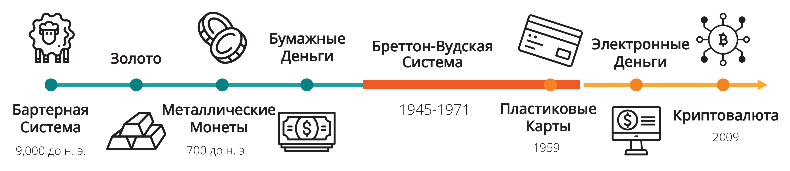
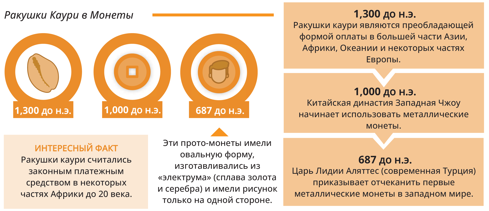

## _Глава №2_

# ***От Бартера к Биткойнам и ЦВЦБ: Путешествие Во Времени***

- [**2.0 Введение**](https://github.com/BabaevDaniel/Bitcoin-Diploma-Russian-Version/blob/main/Translated-text/14.Chapter-2.md#20-%D0%B2%D0%B2%D0%B5%D0%B4%D0%B5%D0%BD%D0%B8%D0%B5)
  - [**2.0.1** Классное Упражнение: Бартерная Игра](https://github.com/BabaevDaniel/Bitcoin-Diploma-Russian-Version/blob/main/Translated-text/14.Chapter-2.md#201-%D0%BA%D0%BB%D0%B0%D1%81%D1%81%D0%BD%D0%BE%D0%B5-%D1%83%D0%BF%D1%80%D0%B0%D0%B6%D0%BD%D0%B5%D0%BD%D0%B8%D0%B5-%D0%B1%D0%B0%D1%80%D1%82%D0%B5%D1%80%D0%BD%D0%B0%D1%8F-%D0%B8%D0%B3%D1%80%D0%B0)         
- [**2.1** Ранние Формы Денег](https://github.com/BabaevDaniel/Bitcoin-Diploma-Russian-Version/blob/main/Translated-text/14.Chapter-2.md#21-%D1%80%D0%B0%D0%BD%D0%BD%D0%B8%D0%B5-%D1%84%D0%BE%D1%80%D0%BC%D1%8B-%D0%B4%D0%B5%D0%BD%D0%B5%D0%B3)       
- [**2.2** От Товаров к Долговым Распискам](https://github.com/BabaevDaniel/Bitcoin-Diploma-Russian-Version/blob/main/Translated-text/14.Chapter-2.md#22-%D0%BE%D1%82-%D1%82%D0%BE%D0%B2%D0%B0%D1%80%D0%BE%D0%B2-%D0%BA-%D0%B4%D0%BE%D0%BB%D0%B3%D0%BE%D0%B2%D1%8B%D0%BC-%D1%80%D0%B0%D1%81%D0%BF%D0%B8%D1%81%D0%BA%D0%B0%D0%BC)       
- [**2.3** Переход от Надёжных Денег к Ненадёжным](https://github.com/BabaevDaniel/Bitcoin-Diploma-Russian-Version/blob/main/Translated-text/14.Chapter-2.md#23-%D0%BF%D0%B5%D1%80%D0%B5%D1%85%D0%BE%D0%B4-%D0%BE%D1%82-%D0%BD%D0%B0%D0%B4%D1%91%D0%B6%D0%BD%D1%8B%D1%85-%D0%B4%D0%B5%D0%BD%D0%B5%D0%B3-%D0%BA-%D0%BD%D0%B5%D0%BD%D0%B0%D0%B4%D1%91%D0%B6%D0%BD%D1%8B%D0%BC)      
- [**2.4** Где Мы Находимся Сегодня?](https://github.com/BabaevDaniel/Bitcoin-Diploma-Russian-Version/blob/main/Translated-text/14.Chapter-2.md#24-%D0%B3%D0%B4%D0%B5-%D0%BC%D1%8B-%D0%BD%D0%B0%D1%85%D0%BE%D0%B4%D0%B8%D0%BC%D1%81%D1%8F-%D1%81%D0%B5%D0%B3%D0%BE%D0%B4%D0%BD%D1%8F)          
- [**2.5** Цена Контроля: Взгляд на Слежку, Цензуру и Регулирование](https://github.com/BabaevDaniel/Bitcoin-Diploma-Russian-Version/blob/main/Translated-text/14.Chapter-2.md#25-%D1%86%D0%B5%D0%BD%D0%B0-%D0%BA%D0%BE%D0%BD%D1%82%D1%80%D0%BE%D0%BB%D1%8F-%D0%B2%D0%B7%D0%B3%D0%BB%D1%8F%D0%B4-%D0%BD%D0%B0-%D1%81%D0%BB%D0%B5%D0%B6%D0%BA%D1%83-%D1%86%D0%B5%D0%BD%D0%B7%D1%83%D1%80%D1%83-%D0%B8-%D1%80%D0%B5%D0%B3%D1%83%D0%BB%D0%B8%D1%80%D0%BE%D0%B2%D0%B0%D0%BD%D0%B8%D0%B5)        
  - [**2.5.1** Возникновение Безналичного Общества](https://github.com/BabaevDaniel/Bitcoin-Diploma-Russian-Version/blob/main/Translated-text/14.Chapter-2.md#251-%D0%B2%D0%BE%D0%B7%D0%BD%D0%B8%D0%BA%D0%BD%D0%BE%D0%B2%D0%B5%D0%BD%D0%B8%D0%B5-%D0%B1%D0%B5%D0%B7%D0%BD%D0%B0%D0%BB%D0%B8%D1%87%D0%BD%D0%BE%D0%B3%D0%BE-%D0%BE%D0%B1%D1%89%D0%B5%D1%81%D1%82%D0%B2%D0%B0)         
  - [**2.5.2** Наблюдение](https://github.com/BabaevDaniel/Bitcoin-Diploma-Russian-Version/blob/main/Translated-text/14.Chapter-2.md#252-%D0%BD%D0%B0%D0%B1%D0%BB%D1%8E%D0%B4%D0%B5%D0%BD%D0%B8%D0%B5)         
  - [**2.5.3** Финансовое Регулирование и Цензура](https://github.com/BabaevDaniel/Bitcoin-Diploma-Russian-Version/blob/main/Translated-text/14.Chapter-2.md#253-%D1%84%D0%B8%D0%BD%D0%B0%D0%BD%D1%81%D0%BE%D0%B2%D0%BE%D0%B5-%D1%80%D0%B5%D0%B3%D1%83%D0%BB%D0%B8%D1%80%D0%BE%D0%B2%D0%B0%D0%BD%D0%B8%D0%B5-%D0%B8-%D1%86%D0%B5%D0%BD%D0%B7%D1%83%D1%80%D0%B0)         

___________________________________________________________________________________________________

### ***2.0 Введение***    

Понятие денег менялось с течением времени. В своих ранних формах, деньги использовались для облегчения торговли и обмена товарами и услугами.

- В древних цивилизациях, люди полагались на бартер — систему прямого обмена товарами и услугами без использования средств обмена.
- Позже, металлические монеты и бумажные деньги стали более удобными формами денег, проложив путь к сложным финансовым системам, которые мы имеем сегодня.

В этой главе, мы отправимся в путешествие во времени, испытав эволюцию денег на собственном опыте. Мы проследим его происхождение и посмотрим, как он менялся и адаптировался на протяжении истории.

### _2.0.1 Классное Упражнение: Бартерная Игра_   

- Раунд №1 – Бартер

Это 6000 год до н.э. Излишне говорить, что деньги в том виде, в каком мы их знаем, еще не были изобретены. Вы находитесь в Месопотамии и напрямую обмениваетесь товарами и услугами друг с другом посредством бартера.

Следует отметить, что многие предприятия по-прежнему принимают неденежные платежи за свои услуги, и правительства рассматривают эти бартерные транзакции так же, как валютные операции для целей налоговой отчетности.

- Разрежьте лист бумаги по пунктирной линии. Ваша цель — продать свое «имею» столько раз, сколько вам нужно, чтобы наконец получить свое первоначальное «хочу». Вы не можете изменить свое первоначальное «хочу». У вас будет 5 минут, чтобы достичь цели этого упражнения.

- Когда ваше новое «имею» совпадет с вашим первоначальным «хочу», вернитесь на свое место. По истечении времени, если вы не нашли торгового партнера, все равно вернитесь на свое место.

___________________________________________________________________________________________________

Поднимите руку, если вы смогли получить то, что хотели, после одной сделки. Две? Трех?

Вопросы. Ответьте на следующие вопросы кратко, но содержательно.

1. Почему некоторым из вас удалось найти кого-то для торговли, а другим — нет?

2. Каковы преимущества бартера?

3. Исходя из вашего опыта выполнения этого упражнения, каковы недостатки использования бартера?

- Раунд №2 – Товарные деньги

Перенесемся вперед и отправимся на западное побережье Африки где-то примерно в 14 веке до нашей эры. Бартер стал утомительным и неэффективным. Мы развились как цивилизация и теперь используем **товарные деньги**.

___________________________________________________________________________________________________

Ваш учитель дал вам одну макарону (для простоты). Предположим, что условно цена каждого товара равна одной макароне. Ваша цель снова — получить то, что вы «хотите». Но теперь наш вид немного поумнел и нашел способ решения определенных проблем.
- Почему мы считаем макароны товарными деньгами?
- Как нам получить то, что мы хотим сейчас?
- С макаронами было проще?
- Как вы думаете, почему деньги заменили товары?
- В каком смысле использование товарных денег более эффективно, чем бартер?
- Каковы недостатки использования макарон в качестве денег?

Как вы думаете, что произошло, когда Испания начала привозить в вашу общину лодки с макаронами (золото и серебро из Америки обратно в Испанию)?
____________________________________________________________________________________________________________
____________________________________________________________________________________________________________
____________________________________________________________________________________________________________
____________________________________________________________________________________________________________
____________________________________________________________________________________________________________
____________________________________________________________________________________________________________

### ***2.1 Ранние Формы Денег***    

Посмотрите это короткое видео из серии «История бумажных денег», чтобы узнать об истоках обмена.

В бартерной экономике, люди торгуют друг с другом, основываясь на относительной стоимости товаров и услуг, которые они могут предложить. Бартерная экономика неэффективна, и ею трудно управлять, особенно в сложных обществах.

Ситуация, известная как двойное совпадение желаний, необходима в любой бартерной системе, поскольку люди всегда должны найти кого-то, кто имеет то, что они хотят, но также хочет того, что они могут предложить.

Я дам тебе обувь за твою пшеницу.

Мне не нужна обувь. Мне нужна одежда.

Я хочу туфли, но у меня нет пшеницы.

___________________________________________________________________________________________________

Предположим:
- Джозеф хочет обменять свой банан на кокос Яэль.
- Но Яэль хочет обменять свой кокос только на манго Тэмми.
- А Тэмми хочет только обменять свое манго на банан Джозефа.
- Они застряли в бесконечном цикле торговли фруктами без двойного совпадения желаний.
- Джозеф предлагает просто обменять фрукты на вкусную холодную газировку, но они понимают, что находятся на отдаленном острове и газировки нет.
- Они решают просто посидеть на пляже и молча насладиться своими фруктами.

Использование общей расчетной единицы, такой как «газировка», делает торговлю и коммерцию намного более эффективными. В древние времена люди начали использовать бусы, ракушки и другие предметы, имевшие ценность в их обществе, в качестве средств обмена.

### ***2.2 От Товаров к Долговым Распискам***

По мере того, как вы и ваше сообщество станете более активно участвовать в торговле и коммерции, вы осознаете ограничения использования бартера и других форм неденежного обмена. Вы решаете использовать металлические монеты в качестве денег.

Почему были изобретены деньги

извини, у меня нет ничего меньшего

Это вторая серия, называется «Не просто лапша» из «Истории бумажных денег».

Эти металлические монеты изготовлены из ценных материалов, таких как золото и серебро, и служат как средством обмены и расчетной единицей для облегчения торговли и коммерции: товарные деньги.

___________________________________________________________________________________________________

Однако, когда вы начнете чаще использовать металлические монеты, вы столкнетесь с некоторыми недостатками. Они могут быть тяжелыми и неудобными для проведения крупных транзакций, и вы замечаете, что некоторые люди пользуются этой системой, переплавляя монеты и создавая новые, смешивая их с более дешевыми металлами, что приводит к росту цен и подрывает доверие к системе.

Стремясь решить эти проблемы, вы и ваше сообщество начинаете использовать бумажные квитанции как форму денег. Эти бумажные квитанции, возникшие в древнем Китае, представляют собой удобную и легко обмениваемую форму валюты. Они обеспечены золотом и другими ценными металлами и могут быть конвертированы в эти металлы в течение семнадцатого по девятнадцатый век. Это позволяет вам иметь более портативную и легко передаваемую форму денег, сохраняя при этом ценность и безопасность драгоценных металлов.

### ***2.3 Переход от Надёжных Денег к Ненадёжным***

Что произойдет, если вы действительно попытаетесь применить доктрину бумажных денег на практике? Узнайте в четвертом выпуске «Истории Бумажных Денег».

Перенесемся в 17 век в Швеции. Теперь вы полностью зависите от банков в хранении ваших ценных активов. Однако вы начинаете замечать что-то подозрительное, происходящее с этими банкирами. Кажется, они выдают больше бумажных квитанций, чем имеют золота на хранении, что позволяет им создавать больше денег, чем у них есть активов для их поддержки. Эта хитрая практика позволяет банкирам получать прибыль от разницы между стоимостью бумажных квитанций и стоимостью золота, которое они держат для своих клиентов.

___________________________________________________________________________________________________

Вы понимаете, что это знаменует собой серьезный сдвиг в том, как работают деньги. Вы переходите от системы надежных денег (т. е. денег, обеспеченных драгоценными металлами) к системе ненадежных денег (т. е. бумажной валюты, не обеспеченной физическим товаром). Этот переход не произошел в одночасье, а скорее представлял собой постепенный процесс, на который повлияли несколько факторов. Промышленная революция с ее массовым производством и урбанизацией сыграла свою роль, равно как и рост передовых финансовых систем, таких как банки и фондовые рынки. Появление центральных банков и других органов денежно-кредитного регулирования способствовало централизации или контролю над деньгами, что привело к выпуску бумажных валют для поддержки экономического роста.

Однако вы также начинаете видеть недостатки этой централизации, включая безответственное потребление, рост долга и манипулирование гражданами посредством экономических стимулов.

До Первой мировой войны, вы могли конвертировать бумажные деньги в определенное количество золота. Но две мировые войны и экономический кризис 1929 года положили этому конец. В 1944 году было подписано Бреттон-Вудское соглашение, устанавливающее доллар США в качестве мировой резервной валюты и фиксирующее стоимость доллара США к цене золота по курсу 35 долларов за унцию. Валюты других стран привязаны к доллару, что помогает стабилизировать международные финансовые рынки.

К сожалению, система начала разрушаться в конце 1960-х годов, что привело к шоку Никсона в 1971 году, когда правительство США приостановило конвертацию доллара в золото. Это знаменует собой конец золотого стандарта и начало мира, движимого созданием и накоплением долга.

В повседневной жизни вы начинаете замечать, что ценность денег уже не такая стабильная, как раньше. Точно так же, как гибкая линейка затрудняет точное измерение длины стола, жизнь в бумажном мире, где стоимость денег зависит от непредсказуемости тех, кто находится у власти, также может затруднить точное измерение стоимости товаров и услуг. Вы чувствуете замешательство и беспокойство, приспосабливаясь к миру, где ценность денег больше не привязана к физическому товару, такому как золото.

___________________________________________________________________________________________________

Вы видите влияние этого сдвига на мировую экономику и начинаете сомневаться в стабильности и надежности бумажных валют. Вы понимаете, что в современном мире доллар больше не является фиксированным и стабильным, как это было, когда он был привязан к золоту, а вместо этого становится подверженным колебаниям. Это затрудняет использование доллара в качестве расчетной единицы, поскольку на его стоимость влияют различные факторы, включая инфляцию (рост цен), процентные ставки, силу экономики страны, политические события, рыночные спекуляции и спрос в международной торговле. Это может быть запутанное и непредсказуемое время, когда вы пытаетесь ориентироваться в постоянно меняющейся стоимости доллара и его влиянии на вашу повседневную жизнь.

Несмотря на усилия по улучшению качества жизни с помощью современных денежных систем, повышения эффективности, расширения доступа к информации и улучшения коммуникации, уровень жизни большинства людей начинает снижаться из-за:

- Злоупотребление централизацией.
- Рост цен.
- Стагнация реальной заработной платы.
- Ослабление валют.
- Необходимость тратить больше денег на меньшее количество вещей.

Это создает проблемы для тех, у кого более низкие экономические ресурсы, которые могут иметь ограниченный доступ к образованию, кредитам, ресурсам, социальным сетям и политическому представительству, что приводит к потенциальным недостаткам в их способности добиться успеха.

В результате кажется, что богатые продолжают становиться богаче, а бедные — беднеть.

"Я не верю, что у нас когда-нибудь снова будут хорошие деньги, пока мы не выберем эту вещь из рук правительства… все, что мы можем сделать, это каким-то хитрым, окольным путем ввести что-то, что они не смогут остановить."

Фридрих Хайек,
Лауреат Нобелевской Премии по Экономике

Рост Производительности и Почасовой Оплаты Труда

ПРИМЕЧАНИЕ - Компенсация включает заработную плату и льготы для производственных и неконтролирующих работников.

___________________________________________________________________________________________________

### ***2.4 Где Мы Находимся Сегодня?***

Сегодня мы прошли долгий путь от появления первой кредитной карты еще в 1950-х годах. Простым движением пластика мы можем купить все, что захотим, когда захотим, без каких-либо хлопот. Это похоже на открытие мира безграничных возможностей, и волнение от открытия того, что он таит в себе, ощутимо… по крайней мере, мы так думали. Мало ли мы знали, что наша зависимость от кредита будет иметь болезненные последствия — например, повышение общей стоимости товаров и стимулирование определенной экономики, обреченной на крах.

По мере развития технологий, меняется и то, как мы обращаемся с деньгами. Интернет становится крупным игроком в финансовом мире: веб-сайты с онлайн-банкинга и электронной коммерции позволяют управлять деньгами и тратить их полностью онлайн.

Банк. Держатель карты. Торговец. Плата за сеть. Курсы обмена.

Затем, в 2009 году, создается первая децентрализованная криптовалюта — Биткойн. По мере роста его популярности он вдохновляет на создание новых технологий и неизведанных границ будущего денег. Итак, как мы узнаем, мы прошли полный круг от надежных денег к ненадежным деньгам и обратно, твёрдые деньги впервые за почти сто лет обрели новый ветер в своих парусах.

### ***2.5 Цена Контроля: Взгляд на Слежку, Цензуру и Регулирование***        

### _2.5.1 Возникновение Безналичного Общества_

Когда в 1950-х годах была представлена первая кредитная карта, люди радовались мысли, что им больше никогда не придется носить с собой наличные. Больше не нужно искать мелочь или неловко выписывать чеки на кассе. Все эти надоедливые посредники теперь могут получать свою долю, даже не осознавая этого, точно так же как потери в сети. Ах, удобство современных финансов.

___________________________________________________________________________________________________

Но с появлением цифровых валют, таких как ЦВЦБ, мы как будто перешли от платы за использование сети к необходимости спрашивать разрешение. Хуже того, теперь мы ожидаем, что правительство будет обыскивать, сканировать и проверять каждый раз, когда мы проезжаем мимо. Контроль и наблюдение заняли место удобства. И так же, как и плата от сети, эти вторжения в нашу финансовую жизнь имеют свою цену, будь то денежную, нарушение конфиденциальности или потерю автономии.

Поскольку все больше наших ежедневных транзакций переходят в онлайн, использование наличных денег снижается. Правительства и финансовые учреждения по всему миру продвигают использование электронных платежей и ужесточают использование физических денег. Эта тенденция вызвала дискуссию о будущем наличных денег и потенциальных последствиях безналичного общества.

Война с наличными деньгами — это термин, который относится к различным усилиям по сокращению использования физических денег, отказу от банкнот высокого номинала и продвижению использования электронных платежей.

Сторонники войны с наличными утверждают, что это сделает транзакции быстрее, удобнее и безопаснее. Критики, однако, опасаются, что это может привести к потере конфиденциальности и финансовой доступности, а также к увеличению рисков мошенничества и кибератак.

Вопрос: Как традиционные банковские методы подвергают риску финансовые данные частных лиц?

Ответ: Используя кредитные и дебетовые карты, банковские переводы и другие централизованно контролируемые платежные сети, люди передают свои личные данные о финансовых транзакциях третьей стороне и потенциально жертвуют своими правами на конфиденциальность.

В этой инфографике мы представим обзор войны с наличными деньгами и рассмотрим все стороны дискуссии. Мы рассмотрим причины, лежащие в основе стремления к безналичному обществу, испытание и обеспокоенность, которые оно поднимает, а также потенциальное влияние на отдельных лиц, предприятия и общество в целом.

Вопрос в том, готовы ли мы заплатить цену за удобство современных финансов или будем искать альтернативные варианты, которые будут отдавать приоритет нашей свободе и конфиденциальности?

Глобальная война с наличными деньгами

Законодатели глобально настаивают на прекращении использования физических наличных денег во всем мире. Это движение часто называют «Войной с наличными», и в нем участвуют три основных игрока:
- Инициаторы.
- Враг.
- Перекрестный огонь.

Дежарден, Джефф. «Глобальная война с наличными». Визуальный капиталист

___________________________________________________________________________________________________

Инициаторы

КТО?
Правительства, центральные банки

ПОЧЕМУ?
Отказ от наличных денег облегчит отслеживание всех видов транзакций, в том числе совершаемых преступниками.

Враг

КТО?
Преступники, террористы

ПОЧЕМУ?
Банкноты крупных номиналов облегчают проведение незаконных операций и повышают анонимность.

Перекрестный огонь

КТО?
Граждане

ПОЧЕМУ?
Принудительное устранение наличных денег будет иметь потенциальные последствия для экономики и социальных свобод.

Наличные Деньги По-Прежнему Являются Королем?

Наличные деньги всегда были королем - но, начиная с конца 1990-х годов, удобство новых технологий помогло сделать безналичные транзакции более жизнеспособными:

ОНЛАЙН БАНКИНГ
ШИФРОВАНИЕ
СМАРТФОНЫ
ПЛАТЕЖНЫЕ ТЕХНОЛОГИИ

Сегодня существует множество способов оплаты в цифровом формате, в том числе:
ПОСРЕДНИКИ
ОНЛАЙН БАНКИНГ
СМАРТФОНЫ
КРИПТОВАЛЮТА

___________________________________________________________________________________________________

К 2015 году, во всем мире было совершено 426 миллиардов безналичных транзакций — на 50% больше, чем пятью годами ранее.

Первые выстрелы.
Успех этих новых технологий побудил законодателей заявить, что все транзакции теперь должны быть цифровыми. Вот их аргументы в пользу безналичного общества:

Изъятие из обращения банкнот крупных номиналов усложняет жизнь террористам, торговцам наркотиками, отмывателям денег и уклоняющимся от уплаты налогов.

1 миллион долларов в 100-долларовых купюрах весит всего десять килограммов (22 фунта).

Преступники ежегодно перемещают по всему миру 2 триллиона долларов.

Купюра в 100 долларов США является самой популярной банкнотой в мире, в обращении находится 10 миллиардов таких банкнот.

Это дает регуляторам больше контроля над экономикой.

Деньги, которые можно отследить, означают более высокие налоговые поступления.

Это также означает, что во всех транзакциях участвует третья сторона.

Центральные банки могут диктовать процентные ставки, которые поощряют (или препятствуют) расходам, пытаясь управлять инфляцией. Сюда входят политики ПНПС или ПОПС.

Безналичные операции осуществляются быстрее и эффективнее.

Банки понесли бы меньше затрат, если бы им не приходилось иметь дело с наличными.

Это также упрощает соблюдение требований и отчетность.

По оценкам некоторых экспертов, «бремя» наличных денег может составлять до 1,5% ВВП.

___________________________________________________________________________________________________

Чтобы это стало возможным, они говорят, что необходимо ликвидировать наличные деньги, особенно купюры крупного номинала.

В конце концов, наличные по-прежнему используются примерно в 85% всех транзакций по всему миру.

Попал под Перекрестным Огнём

Выстрелы правительств, ведущих войну за наличные деньги, могут привести к нескольким непреднамеренным жертвам.

КОНФИДЕНЦИАЛЬНОСТЬ

- Безналичные транзакции всегда будут включать в себя какого-либо посредника или третью сторону.
- Расширение доступа правительства к личным транзакциям и записям.
- Определенные виды транзакций (азартные игры и т. д.) могут быть запрещены или заморожены правительством.
- Децентрализованная криптовалюта может стать альтернативой таким транзакциям.

Сбережения

- Владельцы сбережений больше не могли иметь индивидуальную свободу хранить богатство «вне» системы.
- Устранение наличных денег делает отрицательные процентные ставки (ПОПС) реальным вариантом для политиков.
- Безналичное общество также означает, что все вкладчики окажутся «на крючке» в сценариях банковских залогов.
- У вкладчиков будут ограниченные возможности реагировать на экстремальные монетарные события, такие как дефляция или инфляция.

ПРАВА ЧЕЛОВЕКА

- Быстрая демонетизация нарушила права людей на жизнь и питание.
- В Индии изъятие банкнот номиналом 500 и 1000 рупий привело к множеству человеческих трагедий, в том числе к тому, что пациентам отказывали в лечении, а люди не могли позволить себе еду.
- Демонетизация также наносит ущерб людям и малому бизнесу, которые зарабатывают себе на жизнь в неформальных секторах экономики.

ИНФОРМАЦИОННАЯ БЕЗОПАСНОСТЬ

- Поскольку все богатство хранится в цифровом формате, потенциальный риск и последствия киберпреступности возрастают.
- Взлом или кража личных данных могут разрушить сбережения людей.
- По данным Juniper Research, к 2019 году стоимость утечек онлайн-данных достигла 2,1 триллиона долларов.

___________________________________________________________________________________________________

### _2.5.2 Наблюдение_

Наблюдение – дело непростое. С одной стороны, это помогает поймать людей, совершающих плохие поступки, например, отмывание денег. Но чем больше случаев мошенничества, тем больше необходимо наблюдения, что может привести к вторжению в частную жизнь с помощью технологий. Частные компании также могут собирать и продавать вашу личную информацию в своих целях, и риски такого наблюдения могут включать мошенничество, преследование, вымогательство, кражу личных данных и даже отслеживание покупок по вашей карте. Кроме того, с развитием искусственного интеллекта и машинного обучения, правительствам и компаниям становится еще проще вторгаться в нашу конфиденциальность. Более того, зачастую больше всего страдают люди, которые уже находятся в неблагоприятном или обездоленном положении.

Влияние искусственного интеллекта и технологий на будущую конфиденциальность и наблюдение

Будущий Эффект
- Доступ к личной информации.
- Способность формировать мир в своих интересах.
- Контроль над другими.
- Уязвимость для цифрового мошенничества, онлайн-преследований, вымогательства и кражи личных данных.

Богатые
- Может иметь доступ к обширной личной информации и может использовать ее для принятия обоснованных решений.
- Могут использовать свой доступ к данным, чтобы формировать мир в своих интересах.
- Могут осуществлять контроль над бедными посредством их доступа к данным, что приводит к потере индивидуальной свободы.
- Вероятно, он менее уязвим для этих проблем благодаря большему количеству информации и большей защите от такого мошенничества.

Бедные
- Может не хватать этой информации и, возможно, придется полагаться на устаревшие или ненадежные источники.
- Может иметь незначительное влияние на происходящее.
- Маленький контроль; часто являются контролируемыми.
- Могут быть более уязвимы к этим проблемам из-за отсутствия доступа к ресурсам и информации.

### _2.5.3 Финансовое Регулирование и Цензура_

Финансовое регулирование, цензура и запреты могут стать эмоционально и финансово обременительной реальностью для общества и его граждан. Они бывают разных форм, например:

- Контроль за капиталом или санкции: Когда расходы выходят из-под контроля, правительства могут ввести контроль над ценами, чтобы попытаться решить проблему. Но иногда этот контроль ухудшает ситуацию. Правительства могут также ограничить количество денег, которые граждане могут переводить, обменивать или вывозить из страны. Создать систему социального кредитного рейтинга, которую можно использовать для контроля над гражданами.

___________________________________________________________________________________________________

- Как работает система Социального Кредитного Рейтинга в Китае? В Китае финансовые транзакции и другие данные всех граждан собираются централизованно и используются для создания системы социального кредитного рейтинга, которую можно использовать для контроля граждан.

- Посмотрите, что произошло в Греции в 2015 году — по постановлению правительства граждане могли снимать только 60 евро в день. Аналогичным образом, китайцы могут отправлять из страны лишь ограниченное количество юаней.

- В Аргентине было несколько случаев, когда правительство ввело строгий валютный контроль, чтобы попытаться стабилизировать песо. Один из таких случаев произошел в 2011 году, когда правительство ввело контроль за движением капитала, чтобы остановить отток долларов из страны и предотвратить дальнейшую девальвацию песо. Другой случай был в 2019 году.

- Ограничительная банковская политика: Вы когда-нибудь пытались снять наличные в банкомате только для того, чтобы обнаружить, что вы достигли своего дневного лимита?

Или, может быть, вы пытались перевести деньги другу, но вам сказали, что вы можете отправить определенную максимальную сумму. Это всего лишь несколько примеров ограничительной банковской политики, которая может затруднить доступ к вашим собственным деньгам и делать с ними все, что захотите.

Банки также могут взимать комиссию за большинство транзакций и могут быть открыты только в определенные часы, что затрудняет доступ к вашим наличным или принятие финансовых решений. Ношение с собой большого количества наличных увеличивает риск быть ограбленным. Вдобавок ко всему, банки иногда предлагают богатым кредиты под более низкие проценты, и одновременно открывая бедных для ростовщиков и кредитов под более высокие проценты. При этом финансовая система часто извлекает выгоду из разрыва между богатыми и бедными.

Прочтите следующую статью: «Что нужно знать о переводе денег в Китай и из него».

___________________________________________________________________________________________________

- Дорогие Денежные Переводы: Отправка денег в другие страны может быть дорогостоящей из-за комиссий банков и других финансовых учреждений. Многие семьи с низкими доходами в развивающихся странах полагаются на деньги родственников, живущих за границей, чтобы выжить. Но высокие комиссии за международные денежные переводы могут повлиять на то, сколько денег фактически получит получатель. Из-за этого семьям может быть сложно позволить себе предметы первой необходимости, такие как еда, жилье и образование.
Средняя Комиссия за Денежные Переводы в Латинской Америке
(% от транзакции)

- Представьте себе семью в сельской деревне в Бразилии, которая зависит от денег родственника, работающего в США. Если родственник отправляет 100 долларов, но банк взимает за перевод комиссию в 7 долларов, семья получает только 93 доллара. Это может показаться не так уж и много, но для семьи, живущей с ограниченным бюджетом, потеря 7 долларов может иметь большое значение.

- Не Охваченные Банками и Недостаточно Обеспеченный Банками: К сожалению, не у всех есть доступ к традиционным банковским услугам, будь то потому, что они не соответствуют требованиям для открытия счета или потому, что они живут в районах, где банковские услуги недоступны. Это может затруднить людям доступ к финансовым услугам и участие в глобальной экономике.

45% домохозяйств, не имеющих доступа к банковским услугам, владеют криптовалютой по сравнению с 19% населения в целом.

- Но подождите, это еще не все! Правительства могут также контролировать обменный курс своей валюты, что может затруднить обмен денег между странами или привести к неблагоприятным обменным курсам. Финансовые учреждения могут заблокировать пожертвования определенным организациям или частным лицам или вообще забрать ваш банковский счет. Платформы социальных сетей и финансовые учреждения могут удалить определенный контент, если считают, что он распространяет дезинформацию или нарушает стандарты или политику их сообщества. Иногда это называют цензурой и может включать широкий спектр действий, таких как блокирование или подавление контента, ограничение доступа или полное удаление информации.

___________________________________________________________________________________________________

Наблюдение, контроль и скрытые платежи — это лишь политические недостатки нынешней системы, в которой мы живем. К сожалению, существует также ряд скрытых экономических издержек, о которых мы часто никогда не узнаем.
